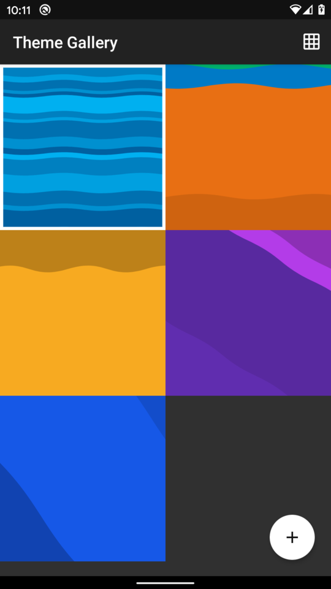
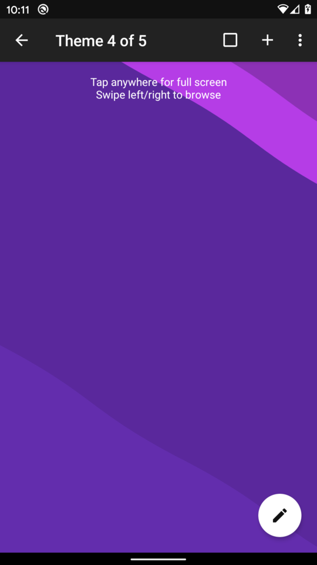
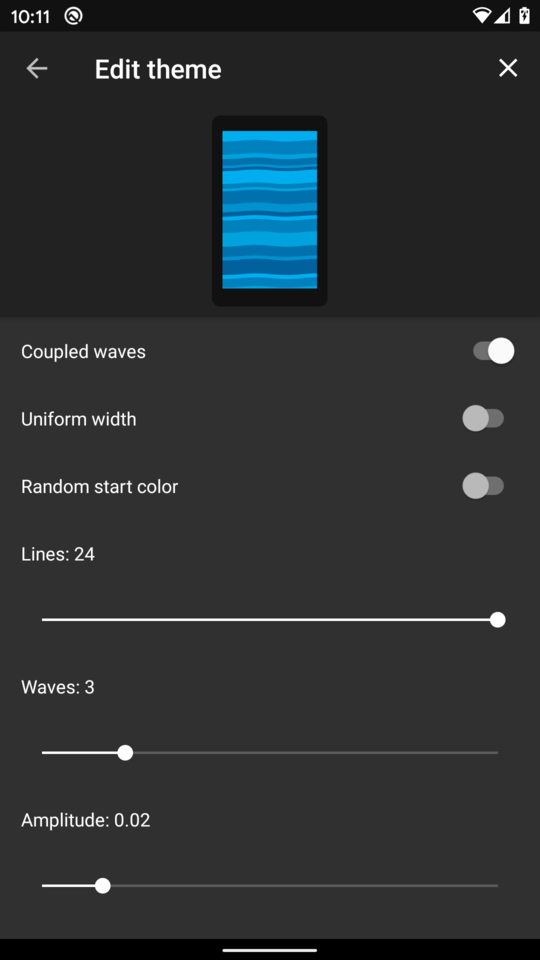

# Wave Lines Live Wallpaper

An Android live wallpaper showing slowly moving wave lines.

Either choose a predefined theme, edit a theme to your liking, or simply
create your own.

If you find this app useful and wish to support its continued development,
you can [buy me a coffee](https://www.buymeacoffee.com/markusfisch) or
send some Bitcoin decimals to `bc1q2guk2rpll587aymrfadkdtpq32448x5khk5j8z`.

&nbsp;

## Screenshots

## Download

